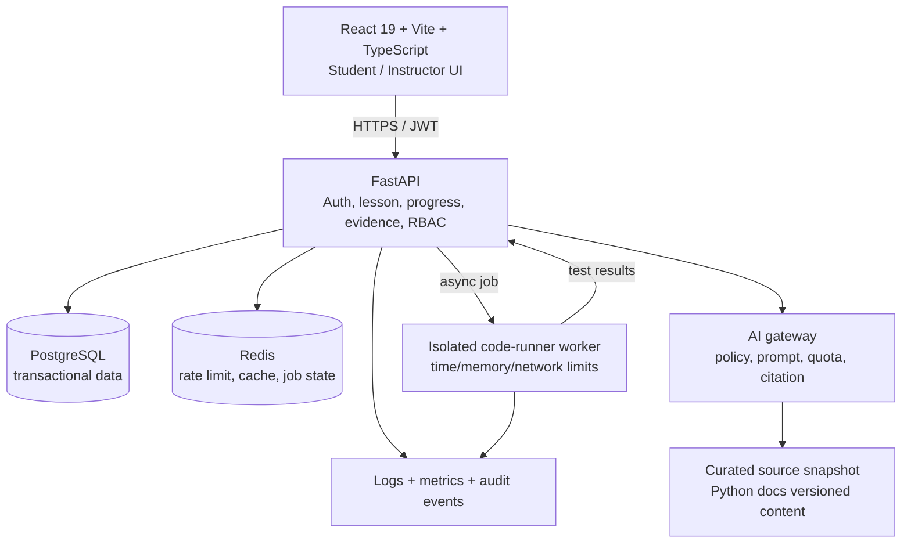
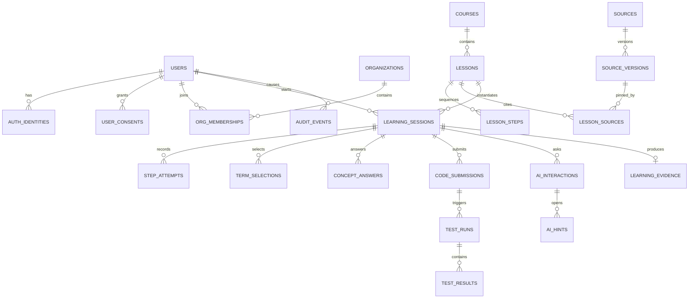

# CodeMind — Nhận xét vòng 3 và kế hoạch dựng MVP

Ngày lập: 22/07/2026  
Mốc nộp theo đề: 12:00, Chủ nhật 09/08/2026

## 1. Kết luận điều hành

CodeMind có một luận điểm sản phẩm tốt: biến việc đọc tài liệu kỹ thuật và sửa lỗi thành một vòng học có bằng chứng, trong đó AI chỉ gợi mở thay vì làm hộ. Figma hiện đã cụ thể hơn đáng kể so với nhận xét vòng 2: có happy path 6 bước, các mức gợi ý Socratic, consent, quyền xem của giảng viên và các recovery state.

Vấn đề lớn nhất không còn là thiếu ý tưởng mà là **scope và bằng chứng vận hành**. 70 frame Figma không nên được hiểu là 70 màn hình phải xây. MVP vòng 3 nên khóa vào một vertical slice duy nhất, triển khai công khai, có dữ liệu đo được và demo trơn tru trong dưới 3 phút.

**MVP được đề xuất:** một bài học `deque` hoàn chỉnh cho sinh viên, từ cam kết/consent → đọc nguồn → chọn thuật ngữ → nối khái niệm → chạy 5 test → nhận tối đa 3 gợi ý → tự sửa đạt 5/5 → xem bằng chứng học tập; kèm trang chỉ đọc cho giảng viên. Các phần Pricing, Checkout, Community, Campus admin, gamification mở rộng và MOSS thời gian thực để sau vòng thi.

## 2. Nhận xét tài liệu hiện tại

### Điểm mạnh

- Problem–solution fit nhất quán: rào cản tiếng Anh, tài liệu phân mảnh, thiếu phản hồi cá nhân hóa và lạm dụng AI.
- Khác biệt sản phẩm dễ kể: Source Trust + Socratic AI + bằng chứng tự sửa.
- Mô hình doanh thu và unit economics đã được suy nghĩ sớm; phù hợp để phát triển sau khi có pilot.
- Figma có nhiều trạng thái thực tế hơn một prototype trình diễn: source unavailable, quota, lỗi nộp bài, consent và teacher visibility.

### Điểm cần sửa ngay

1. File Word mang tên `CodeMind - FundFlow.docx` nhưng nội dung là CodeMind; phải thống nhất tên dự án và tên file.
2. Mục lục Word đang hiện `Error! No bookmark name given.` trên toàn bộ mục; đây là lỗi trình bày nghiêm trọng.
3. Báo cáo hiện dài, nhiều chữ, ít sơ đồ; một số bảng bị ngắt trang và không lặp header. Cần viết lại theo cấu trúc đề vòng 3, không nối thêm vào báo cáo vòng 2.
4. Thông báo làm rõ mới hơn của Ban Tổ chức giới hạn **báo cáo chi tiết tối đa 60 trang nội dung**, không tính bìa/phụ lục. Giới hạn dung lượng an toàn **30 MB** trong đề gốc vẫn nên được giữ. Bản báo cáo mới phải theo Proposal Template, có kiến trúc, ERD, API, QA, security, deployment và tài chính 12 tháng; không nối thêm vào báo cáo Vòng 2.
5. Các số liệu thị trường/CAC chủ yếu là giả định. Cần gắn nhãn “assumption” và bổ sung pilot 30–50 sinh viên, completion, self-correction và D7 retention.
6. MOSS chưa có bằng chứng triển khai. Chỉ nên để là kiểm tra bất đồng bộ/roadmap, không đặt trong critical path của demo.
7. Phần bảo mật cần mô tả rõ dữ liệu nào giảng viên/trường được xem, cơ sở consent, thời hạn lưu, xóa/xuất dữ liệu và audit log.

## 3. Đọc Figma theo góc nhìn triển khai

### Những gì nên giữ

- App shell và tiến trình 6 bước tạo mental model rõ.
- `Official Docs Reader` buộc người học tự chọn thuật ngữ thay vì hệ thống đoán trước.
- Concept check đơn giản hơn mindmap tự do, phù hợp MVP và dễ chấm tự động.
- Code submission có test count; AI refusal và hint ladder 1–3 tạo dấu vết can thiệp.
- So sánh mã trước/sau là bằng chứng học tập mạnh cho pitch.
- Consent và teacher visibility tách “cam kết bắt buộc” khỏi “quyền chia sẻ tùy chọn”.
- Recovery state giữ lại tiến trình khi nguồn lỗi là một chi tiết sản phẩm tốt.

### Những gì phải làm rõ trước khi code

- Quy định chính xác điều kiện mở bước, quay lại bước, hết quota và hoàn thành bài.
- Xác định phiên bản nguồn đã lưu để replay; không chỉ lưu URL hiện tại.
- Chuẩn hóa semantics: `learning_session`, `step_attempt`, `submission`, `test_run`, `hint`, `evidence`.
- Thiết kế responsive thực sự; frame 1440×900 và absolute layout trong mã tham chiếu không phải code production.
- Audit WCAG cho chữ 12–14px trên nền tối, focus state, keyboard, error announcement và code editor trên mobile.
- Copy “demo 3–4 phút” trên landing phải đổi thành luồng có thể hoàn tất trong tối đa 3 phút theo đề thi.

### Scope freeze

| Mức | Phạm vi | Quyết định |
|---|---|---|
| P0 | Auth tối giản, consent, một lesson `deque`, nguồn đã xác thực, chọn thuật ngữ, concept check, code/test, 3 hint, evidence, progress restore, teacher read-only, audit cơ bản | Bắt buộc dựng thật |
| P1 | Notes, quota, source fallback, submission retry, analytics dashboard tối giản, admin seed content | Làm nếu P0 ổn định |
| P2 | Pricing/checkout, Campus admin đầy đủ, community, leaderboard/hearts, adaptive VARK, nhiều course, MOSS sync, mobile code editor hoàn chỉnh | Sau vòng 3 |

## 4. Actor, use case và tiêu chí thành công

### Actor

- **Student:** học, chạy test, nhận gợi ý, nộp và xem evidence.
- **Instructor:** chỉ xem các phiên được người học cho phép; không xem ngoài phạm vi consent.
- **Content admin:** quản lý lesson/source/test/hint policy và demo account.
- **System/AI provider/code runner:** dịch vụ phụ trợ, không phải người dùng.

### Happy path demo

```mermaid
flowchart LR
    A["Đăng nhập demo"] --> B["Cam kết và chọn quyền chia sẻ"]
    B --> C["Đọc nguồn đã xác thực"]
    C --> D["Chọn thuật ngữ cần làm rõ"]
    D --> E["Nối 2 quan hệ khái niệm"]
    E --> F["Viết mã và chạy 4/5 test"]
    F --> G["AI từ chối đáp án; mở hint 1–3"]
    G --> H["Tự sửa đạt 5/5"]
    H --> I["Lưu evidence trước/sau và hoàn thành"]
    I --> J["Giảng viên xem phiên đã được cho phép"]
```

### North-star và guardrail cho pilot

| Chỉ số | Định nghĩa | Mục tiêu pilot đề xuất |
|---|---|---|
| Lesson completion | Phiên hoàn tất / phiên bắt đầu | ≥ 60% |
| Self-correction | Đạt test sau ít nhất 1 lần fail và không nhận đáp án hoàn chỉnh | ≥ 50% phiên hoàn tất |
| D7 retention | Người học quay lại trong ngày 7 ±1 | ≥ 20% |
| Source engagement | Có chọn thuật ngữ và hoàn tất concept check | ≥ 70% phiên bắt đầu |
| Hint efficiency | Trung vị số hint trước khi đạt test | ≤ 2 |
| P95 API | API thường, không tính code runner/LLM | < 500 ms |
| P95 AI first token | Từ gửi câu hỏi tới phản hồi đầu tiên | < 4 s |
| Critical error rate | Phiên bị chặn không phục hồi | < 2% |

## 5. Kiến trúc MVP

Giữ stack đã đề xuất nhưng tách code execution khỏi API chính. Redis chỉ dùng khi có mục đích rõ (rate limit, job, cache), không đưa vào để “đủ công nghệ”.

### Nguyên tắc kỹ thuật

- Không chạy mã sinh viên trong process FastAPI. Code runner phải cô lập, chặn network, giới hạn CPU/RAM/thời gian/output.
- PostgreSQL là nguồn sự thật. Redis mất dữ liệu không được làm mất tiến trình học.
- Source có `version`, `checksum`, `retrieved_at` và snapshot để bằng chứng không đổi theo trang web ngoài.
- Hidden test chỉ trả kết quả đã lọc; không gửi expected output/implementation xuống client.
- AI gateway lưu model, prompt version, latency, token/cost, policy decision và citations; không lưu chain-of-thought.
- Mọi truy cập dữ liệu học tập của giảng viên phải qua RBAC + consent + audit event.
- Backup DB hằng ngày; thử restore trước ngày demo. Có seed script tạo demo accounts và lesson.

## 6. Mô hình dữ liệu lõi

Chi tiết field, kiểu dữ liệu, khóa, PII, retention, RBAC, API và traceability nằm trong workbook `CodeMind_MVP_Data_Spec.xlsx` đi kèm.

## 7. API tối thiểu

| Method | Endpoint | Mục đích |
|---|---|---|
| POST | `/v1/demo/session` | Đăng nhập/tạo phiên demo có TTL |
| GET | `/v1/lessons/{slug}` | Lấy lesson, step và source version công khai |
| POST | `/v1/learning-sessions` | Bắt đầu lesson sau khi consent hợp lệ |
| PATCH | `/v1/learning-sessions/{id}/progress` | Lưu step hiện tại có optimistic version |
| POST | `/v1/sessions/{id}/terms` | Lưu thuật ngữ người học tự chọn |
| POST | `/v1/sessions/{id}/concept-answers` | Chấm quan hệ khái niệm |
| POST | `/v1/sessions/{id}/submissions` | Tạo submission và idempotency key |
| GET | `/v1/submissions/{id}` | Poll trạng thái/test result đã lọc |
| POST | `/v1/sessions/{id}/ai-interactions` | Gửi câu hỏi qua policy Socratic |
| POST | `/v1/ai-interactions/{id}/hints/{level}/open` | Mở hint theo thứ tự và quota |
| POST | `/v1/sessions/{id}/complete` | Kiểm tra invariant và tạo evidence |
| GET | `/v1/sessions/{id}/evidence` | Student hoặc instructor có quyền xem |
| DELETE | `/v1/me/data` | Tạo yêu cầu xóa dữ liệu người dùng |

## 8. Security, privacy và QA

### Quy tắc dữ liệu

- Thu tối thiểu: email/display name, role, consent, tiến trình, code submission, AI/hint event và audit.
- Không dùng device fingerprint ở P0. Nếu bổ sung phải có mục đích chống gian lận, disclosure và retention riêng.
- Code submission có thể chứa dữ liệu cá nhân vô tình; phân loại `Confidential`, mã hóa khi lưu, xóa raw code sau 180 ngày; giữ metrics tổng hợp lâu hơn.
- Consent bắt buộc và teacher visibility là hai bản ghi/quyết định riêng, có version, timestamp và revoke.
- Instructor chỉ thấy phiên thuộc tổ chức/lớp của họ và có `teacher_visibility = true`.
- Không log access token, raw password, hidden expected output hay toàn bộ prompt chứa dữ liệu nhạy cảm.

### Test gates trước demo

- Unit: transition 6 bước, hint ladder, quota, scoring, RBAC, consent.
- Integration: DB migration/rollback, AI timeout, code-runner timeout, source fallback, idempotent submission.
- E2E: happy path student; source unavailable; submission retry; quota exceeded; instructor denied/allowed.
- Security: OWASP baseline, dependency scan, rate limit, CORS/CSRF phù hợp cơ chế auth, secret scan.
- Performance: ít nhất 50 virtual users, code jobs có queue, không block API.
- Recovery: backup + restore rehearsal; seed demo; feature flag tắt AI và dùng canned hints nếu provider lỗi.

## 9. Kế hoạch từ 22/07 đến 09/08/2026

| Ngày | Mục tiêu | Definition of Done |
|---|---|---|
| 22–24/07 | Scope freeze, use case, data/API contract, repo/CI, DB migration đầu | P0 không còn yêu cầu mơ hồ; schema/API review xong |
| 25–30/07 | Vertical slice không AI: auth demo → consent → source → concept → code runner → progress | Happy path đạt 5/5 trên staging; dữ liệu phục hồi sau refresh |
| 31/07–03/08 | AI gateway, hint ladder, evidence, teacher read-only, analytics events | Policy test pass; RBAC/consent audit pass |
| 04–06/08 | Recovery states, P1 chọn lọc, security/performance/E2E, backup/restore | Không còn P0 blocker; P95 và error rate được ghi nhận |
| 07/08 | Freeze code, deploy production, pilot rehearsal 5–10 người, chốt số liệu | URL public ổn định; demo accounts hoạt động |
| 08/08 | Hoàn thiện PDF báo cáo chi tiết ≤60 trang, video ≤3 phút, pitch 5 phút, backup video/data | Tất cả link public và mở incognito được; giới hạn 30 MB theo đề gốc vẫn được giữ |
| 09/08 trước 10:00 | Nộp sớm, kiểm tra checksum/link/quyền truy cập | Có biên nhận; còn buffer 2 giờ trước deadline |

### Mốc kiểm chứng hiện hành (09/08/2026)

Nguồn trạng thái hiện hành là [`CodeMind_Progress_Log.md`](CodeMind_Progress_Log.md): backend Ruff/compile và API contract **20 route bắt buộc**, **12 pytest pass**; frontend **ESLint và production build pass**. Build đã được chạy lại tại thư mục MVP gốc sau khi canonical hóa Vite root cho junction/D:. Các số lượng 4/5/6/8 test hoặc 16/18 route bên dưới là bản ghi theo thời điểm, chỉ để truy vết và **không** phải gate hiện hành.

### Bản ghi lịch sử tại thời điểm 06/08/2026 — Mốc 22–24/07

Đã hoàn tất ở mức baseline
scope/contract/repo. P0 đã được khóa trong
[`CodeMind_MVP_Scope_Freeze.md`](CodeMind_MVP_Scope_Freeze.md), backend có migration
đầu và API contract checker, CI đã được thêm tại `/.github/workflows/ci.yml`.
Backend lint, syntax, contract check và 4 test API đều pass; frontend lint/build cũng
pass. PostgreSQL runtime, deploy, load/security, backup/restore và pilot vẫn chưa
được tính là hoàn thành trong mốc này. Đây là kết quả ghi nhận ở thời điểm 06/08, đã được thay thế về mặt gate hiện hành bởi mốc 20 route/12 pytest ở trên.

### Bản ghi lịch sử tại thời điểm 07/08/2026 — Mốc 25–30/07

Vertical slice không AI đã nối
được ở local: demo login → consent → source snapshot → concept check → code
runner → progress/evidence. Frontend có API client, localStorage restore và Vite
proxy `/api`; backend có test happy path 4/5 → 5/5 và GET session sau complete.
Lint/build frontend, lint/contract/5 test backend đều pass ở thời điểm đó. Sau mốc này,
local profile đã chuyển sang `PersistentRepository` snapshot JSON; vẫn không phải
PostgreSQL runtime. Runner vẫn là simulated, nên chưa được đánh dấu staging/production. Các số liệu 5 test và trạng thái build ở đoạn này chỉ mang tính lịch sử, không thay thế trạng thái kiểm chứng hiện hành.

### Bản ghi lịch sử tại thời điểm 09/08/2026 — Stage 3 local

Stage 3 local đã hoàn tất nhưng chưa đủ Definition of
Done của staging. Scope/data/API/repo/CI và flow local có bằng chứng; PostgreSQL
runtime, runner cô lập, AI gateway production, E2E/security/performance,
backup/restore, public deploy và pilot vẫn để `[ ]` hoặc `[~]`. Một lần chạy sớm có
lỗi quyền WindowsApps/`node_modules`, nhưng gate được chạy lại sau đó đã pass như cập
nhật Stage 3 bên dưới; không dùng lỗi môi trường đó để suy ra lỗi chức năng. Nhật ký
team hiện hành nằm tại [`CodeMind_Progress_Log.md`](CodeMind_Progress_Log.md).

Mốc 31/07–03/08 đã đạt DoD ở local tại thời điểm ghi nhận.
Backend đã tách `AIGateway` khỏi route với canned fallback offline; response có
policy decision/version, model id, latency, quota cost và citation tới source
version. Quota mặc định là 3 lượt hỏi mỗi session, vượt quota trả `429` có details.
Analytics event được redacted và lưu cùng persistent snapshot; `content_admin` mới
đọc được endpoint analytics. Instructor summary read-only kiểm tra role,
organization và `teacher_visibility`, không trả raw code. Frontend live practice đã
nối hỏi AI → citation link → mở hint 1–3 theo thứ tự. Gate local: Ruff, compile,
contract 18 route, **8 pytest**, ESLint và production build đều pass tại thời điểm đó. Đây là bản ghi lịch sử, đã được thay thế bởi gate backend 20 route/12 pytest; không dùng để kết luận trạng thái production build frontend hiện tại. Provider AI thật, PostgreSQL runtime, runner cô lập, staging security/performance/E2E, monitoring, backup/restore và public deploy vẫn là các mốc chưa hoàn tất.

### Phân công tối thiểu

- Product/BA: scope, acceptance, traceability, pilot và báo cáo.
- Frontend: app shell responsive, 6-step flow, accessibility, error states.
- Backend/Data: schema, API, RBAC, audit, deployment, observability.
- AI/Runner: policy, source/citation, quota, isolated test execution.
- QA/DevOps: CI/CD, E2E, load/security, backup và demo rehearsal.

Nếu đội ít người, một người có thể kiêm vai trò nhưng mỗi workstream vẫn cần owner và reviewer.

## 10. Cấu trúc báo cáo vòng 3 đề xuất (≤60 trang nội dung)

| Phần | Trang gợi ý | Nội dung |
|---|---:|---|
| Bìa | Không tính | Tên đội, sản phẩm, link public |
| Executive summary | 1–2 | Pain, solution, target, USP, trạng thái kiểm chứng và giả định pilot |
| MVP và user flow | 3–14 | P0 đã triển khai, UI/flow, thay đổi từ Vòng 2, ranh giới prototype/live |
| Kiến trúc, ERD, dữ liệu và API | 15–30 | Sơ đồ, entities, RBAC/consent, lifecycle, API và AI/third-party boundary |
| Deployment, QA và security | 31–38 | CI/CD boundary, test evidence, backup/restore, monitoring và rủi ro chưa đóng |
| Demo/deployment evidence | 39–41 | URL, role/account handoff, checklist incognito; video chỉ là yêu cầu official tách riêng |
| Lean Canvas/revenue | 42–46 | Segment, value, channel, revenue/cost; đánh dấu mọi giả định |
| Customer journey/marketing | 47–51 | Funnel 100→1000, content, KPI, CAC assumption |
| Tài chính 12 tháng | 52–56 | Capex/Opex/revenue/break-even, 3 kịch bản |
| Roadmap/risk/conclusion | 57–60 | 3/6/12 tháng, owner/mitigation và điều kiện chứng minh tiếp theo |
| Phụ lục | Không tính | Data dictionary, API chi tiết, test log, survey/pilot |

## 11. Checklist nộp và demo

- [~] PDF báo cáo chi tiết đã có bản render QA 22 trang vật lý/~185 KB; cấu trúc phải giữ **≤60 trang nội dung** (không tính bìa/phụ lục) và **≤30 MB**. Còn điền thông tin đội, URL public, dữ liệu pilot và rà soát cuối trước nộp.
- [ ] URL MVP public, HTTPS, không localhost; kiểm tra bằng cửa sổ ẩn danh/mạng khác.
- [ ] 3 tài khoản demo: student, instructor, content admin; role xác nhận và credential bàn giao qua kênh riêng, không ghi mật khẩu vào Git/PDF công khai.
- [ ] Video ≤3 phút và slide trình bày: yêu cầu official nhưng nằm ngoài phạm vi làm việc hiện tại theo chủ dự án; phải tự bổ sung hoặc có miễn trừ trước khi nộp chính thức.
- [ ] Dữ liệu demo được seed và reset được; có fallback khi AI/source lỗi.
- [ ] Báo cáo chỉ nói “đã triển khai” với chức năng thực sự chạy; phần khác gắn “roadmap”.
- [ ] Pilot/log/test evidence có ngày, cỡ mẫu, định nghĩa chỉ số và giới hạn.
- [ ] Tất cả link để public/view, không yêu cầu quyền riêng tư của thành viên đội.

## 12. Quyết định cần chốt trong 24 giờ

1. P0 chính thức có đúng một lesson `deque` hay thêm lesson thứ hai. Khuyến nghị: một lesson thật tốt.
2. Code runner dùng dịch vụ có sẵn hay worker tự quản. Khuyến nghị: chọn phương án đội đã vận hành quen; luôn cô lập khỏi API.
3. Instructor view thuộc tổ chức/lớp nào và ai cấp quyền membership.
4. Raw code retention là 90 hay 180 ngày; khuyến nghị 180 cho pilot rồi xóa/anonymize.
5. Định nghĩa “AI không làm hộ” có bộ test prompt nào; cần ít nhất 20 adversarial cases.
6. Người chịu trách nhiệm cuối cùng cho deploy, demo, báo cáo và giờ nộp.
